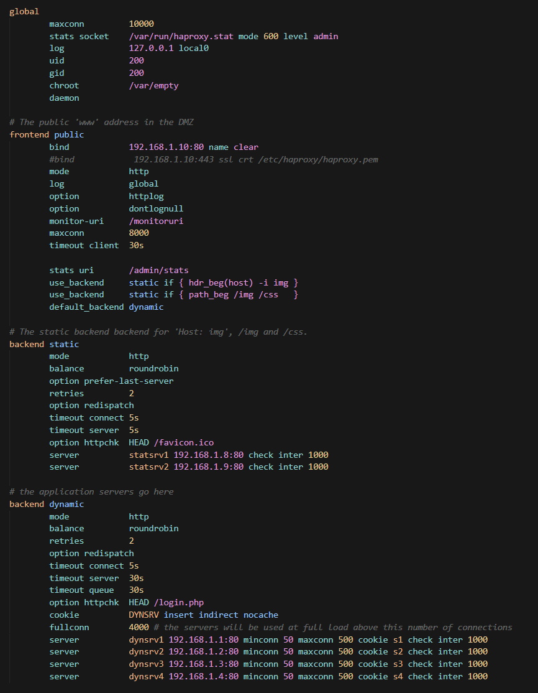
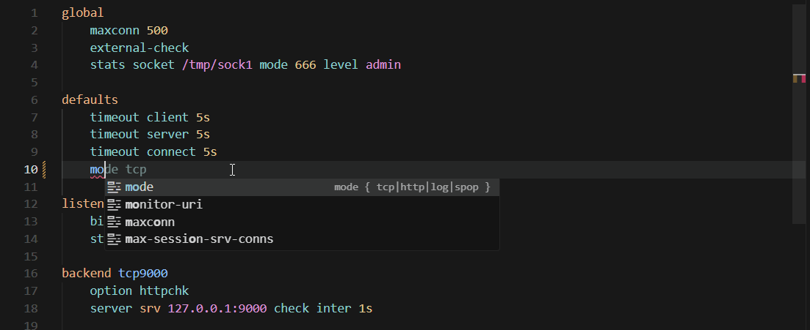
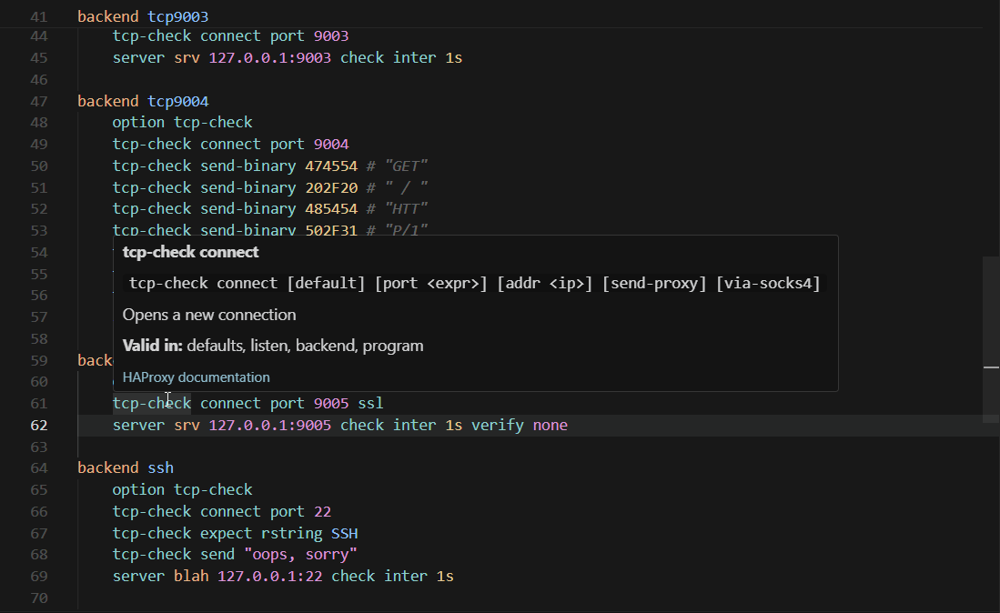
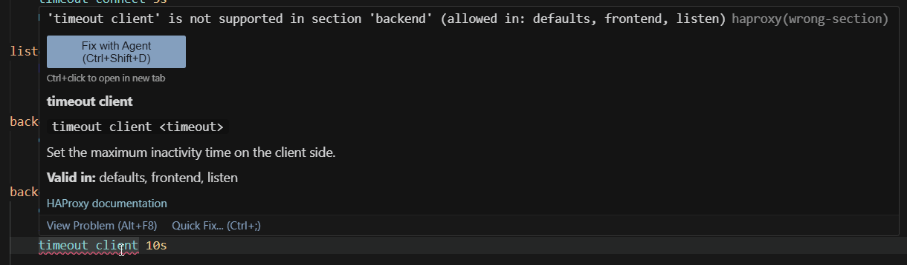
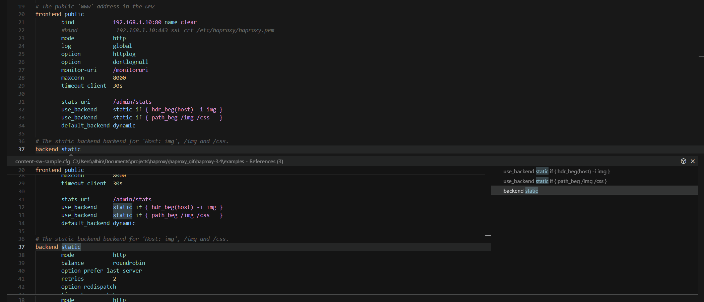
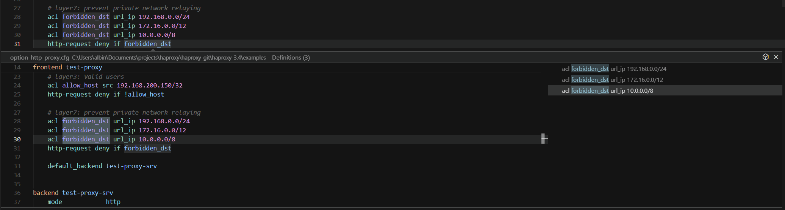
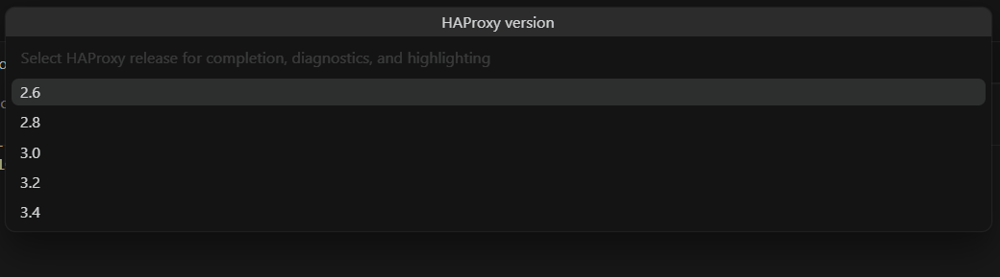
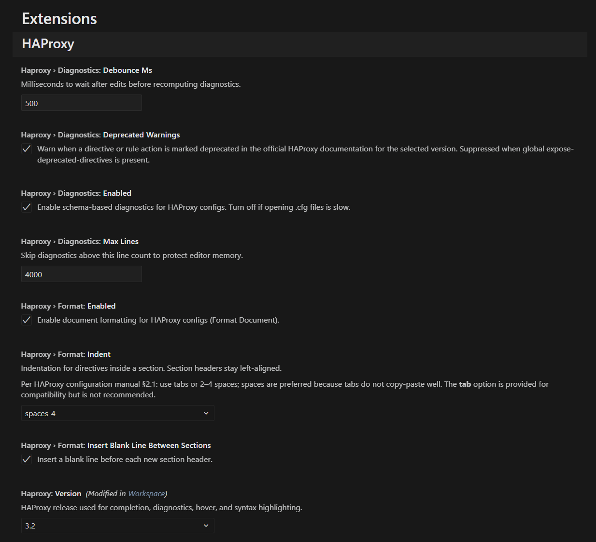

# HAProxy Language Support

[](https://github.com/Exymat/haproxy-vscode/actions/workflows/test.yml)
[](https://codecov.io/gh/Exymat/haproxy-vscode)
[](LICENSE)
[](https://github.com/Exymat/haproxy-vscode/issues)
[](https://nodejs.org/)

**Schema-driven language support for HAProxy configuration files** in Visual Studio Code and compatible editors.

Open any `.cfg` file and get syntax highlighting, context-aware completion, inline documentation, schema-based diagnostics, **go to definition** and **find all references**, document formatting, and section outline — all tuned to the HAProxy release you run in production (**2.6**, **2.8**, **3.0**, **3.2**, or **3.4**).

---

## Features

### Syntax highlighting

Colorization is generated from HAProxy’s own keyword inventory (`haproxy -dKall`), not hand-maintained lists. Sections, directives, ACLs, sample expressions, and related constructs are scoped consistently across large configs.



### Intelligent completion

Suggestions follow where you are in the file:

- **Global and section headers** (`global`, `defaults`, `frontend`, `backend`, `listen`, …)
- **Directives and keywords** valid for the current section
- **`option` / `default-server` values**, HTTP/TCP rule actions, ACL criteria
- **`bind` and `server` parameters**, stick-table keys, filter/trace arguments
- **Sample fetches and converters** inside expressions
- **Enum argument values** where the schema defines allowed choices (e.g. `mode tcp|http`)

Completion reloads immediately when you change the configured HAProxy version.



### Inline documentation

Hover any supported keyword to read summaries sourced from HAProxy’s official `configuration.txt`. Many entries include a **link to the upstream HAProxy documentation** for the full reference. Conditional block directives (`.if`, `.elif`, `.else`, `.endif`) are documented as well, and hovers distinguish section scope such as **Valid in sections: defaults, frontend, listen, backend** from mode scope such as **Valid in modes: tcp, http, log** when available.



### Real-time diagnostics

Catch common mistakes while you type:

| Category    | Examples                                                                                                                |
| ----------- | ----------------------------------------------------------------------------------------------------------------------- |
| Keywords    | Unknown directive, keyword used in the wrong section, **deprecated** keyword                                            |
| Structure   | Nested `option` / parameter misuse; keywords marked `(!)` in anonymous `defaults`; modifier-prefixed directives/actions |
| Arguments   | Missing or extra arguments for known statement shapes                                                                   |
| Expressions | Invalid sample fetch / converter references, ACL-only criteria misuse                                                   |
| Context     | Mode-aware `wrong-context` checks for directives/options that only apply to specific modes                              |
| Rules       | Unknown or **deprecated** `http-request` / `tcp-request` action, unknown `use-service` target                           |

Diagnostics are **schema-based** — they help you write valid-looking config faster, but they do **not** replace `haproxy -c` for a full syntax check. Context checks use the effective runtime mode inferred from your section/config flow, but you should still validate with your real binary before deploying.

**Unused symbol hints** (opt-in via `haproxy.diagnostics.unusedSymbols`) fade ACLs, servers, and whole section blocks that appear unreferenced in the current file — similar to unused-code hints in Ty or Pylance. Analysis is single-file and heuristic: it does not follow `include` directives or detect runtime-only references.



### Document formatting

Run **Format Document** (or enable format-on-save) to normalize layout according to HAProxy’s configuration file rules:

- Section headers (`global`, `frontend`, …) stay left-aligned; directives inside a section are indented consistently.
- Comments and quoted strings are preserved; inline `#` comments stay on the same line.
- Optional blank lines are inserted before each new section header.

Indent style (4 spaces, 2 spaces, or tab) and blank-line behavior are configurable — see **Settings** below.

### Outline and folding

Navigate large configs with built-in structure support:

- **Outline** — lists every top-level section (`frontend www`, `backend api`, …) so you can jump quickly.
- **Folding** — collapse a section’s body while keeping its header visible.

### Go to definition and find references

Jump across related config with standard editor navigation (**Go to Definition**, **Go to References**, peek view):

- **Frontends / backends / listen** — `use_backend`, `default_backend`, and section headers link to the matching proxy section
- **ACLs** — definitions and uses in `if` / `unless` conditions within the same section (including negated forms like `!is_api`)
- **Servers** — `server` lines and `use-server` references inside a backend or listen
- **Defaults profiles** — `defaults … from <profile>` links to the named profile
- **Filters, cache, userlist, resolvers, peers** — section and statement definitions indexed from the schema





---

## Getting started

1. **Install** the extension from the Marketplace (or load a `.vsix` locally).
2. **Open** a HAProxy config (`.cfg` extension is recognized automatically).
3. **Choose your HAProxy version** so completion, hover, diagnostics, formatting, and highlighting match your deployment (see below).

No extra runtime is required for day-to-day editing — schemas and grammars ship with the extension.

---

## HAProxy version

Pick the release that matches the binaries you operate:

| Version | Default? | Notes                                      |
| ------- | -------- | ------------------------------------------ |
| **3.2** | Yes      | Recommended for most users on the 3.x line |
| **3.4** |          | Latest supported 3.x line                  |
| **3.0** |          | 3.x LTS                                    |
| **2.8** |          | Latest supported 2.x line                  |
| **2.6** |          | 2.x LTS                                    |

Schemas for **2.6** and **2.8** are generated from the legacy `configuration.txt` layout (actions listed under each ruleset in §4.2 rather than §4.3/§4.4). Completion, diagnostics, and hover reflect keywords available in that release.

**Ways to change version:**

- **Status bar** — click **HAProxy** while a `.cfg` file is active.
- **Command Palette** — run **HAProxy: Select HAProxy Version**.
- **Settings** — set **HAProxy: Version** (`haproxy.version`).

Completion, diagnostics, and hover update as soon as the setting changes. Syntax highlighting switches the active TextMate grammar; if colors do not refresh, use **Developer: Reload Window** when prompted.



---

## Settings

| Setting                                         | Default    | Description                                                                                                                                                    |
| ----------------------------------------------- | ---------- | -------------------------------------------------------------------------------------------------------------------------------------------------------------- |
| `haproxy.version`                               | `3.2`      | HAProxy release used for completion, diagnostics, hover, and syntax highlighting                                                                               |
| `haproxy.diagnostics.enabled`                   | `true`     | Turn off if opening very large `.cfg` files feels slow                                                                                                         |
| `haproxy.diagnostics.debounceMs`                | `500`      | Delay after edits before recomputing diagnostics (100-5000 ms)                                                                                                 |
| `haproxy.diagnostics.maxLines`                  | `4000`     | Skip diagnostics above this line count to limit memory use                                                                                                     |
| `haproxy.diagnostics.deprecatedWarnings`        | `true`     | Warn on directives and rule actions marked `(deprecated)` in the official docs. Warnings are suppressed when `global` contains `expose-deprecated-directives`. |
| `haproxy.diagnostics.unusedSymbols`             | `false`    | Hint and fade ACLs, servers, and sections that appear unused in the current file (Ty-style unnecessary-code styling).                                          |
| `haproxy.diagnostics.unusedSymbols.sections`    | `true`     | When unused hints are enabled, include whole unused section blocks (backends, named defaults, cache, userlist, resolvers, peers).                              |
| `haproxy.format.enabled`                        | `true`     | Enable **Format Document** for HAProxy configs                                                                                                                 |
| `haproxy.format.indent`                         | `spaces-4` | Indentation inside sections: `spaces-4`, `spaces-2`, or `tab`                                                                                                  |
| `haproxy.format.insertBlankLineBetweenSections` | `true`     | Insert a blank line before each new section header when formatting                                                                                             |

The extension also raises `editor.maxTokenizationLineLength` for HAProxy files so long `server` / `bind` lines tokenize correctly.



---

## Commands

| Command                             | Description                                    |
| ----------------------------------- | ---------------------------------------------- |
| **HAProxy: Select HAProxy Version** | Quick-pick between 2.6, 2.8, 3.0, 3.2, and 3.4 |

---

## How it works

Language data is built offline from two upstream sources:

1. **`configuration.txt`** — descriptions and documentation structure per HAProxy release.
2. **`haproxy -dKall`** — the complete keyword list emitted by the binary.

Those inputs are merged into JSON schemas, completion/hover payloads, and TextMate grammars (see the companion [**haproxy-schema**](https://github.com/Exymat/haproxy-schema) repository). The VS Code extension loads the bundled artifacts for the version you select — no Python or local HAProxy install needed to **use** the extension.

---

## Performance

The extension is built for interactive editing. The table below shows **median** timings from our automated micro-benchmarks (`npm run bench`) on Node.js 24 — they exercise the same TypeScript code paths as the extension host, using bundled schemas and synthetic `.cfg` fixtures.

| Operation                                                     | Small config (~18 lines) | Medium config (~100 lines) | Stress config (24,000 lines) |
| ------------------------------------------------------------- | ------------------------ | -------------------------- | ---------------------------- |
| **Startup** — load schema + language data (first `.cfg` open) | —                        | —                          | ~13 ms                       |
| **Syntax highlighting** — full grammar tokenize¹              | ~6 ms                    | ~8 ms                      | ~1.7 s                       |
| **Diagnostics** — one full pass²                              | ~0.1–0.3 ms              | ~0.9–1.0 ms                | ~150–260 ms                  |
| **Diagnostics + unused-symbol hints**                         | —                        | —                          | ~150–290 ms                  |
| **Format document**                                           | <0.01 ms                 | ~0.06 ms                   | ~19–21 ms                    |
| **Completion** at cursor                                      | <0.01 ms                 | —                          | ~14 ms                       |
| **Hover**                                                     | <0.1 ms                  | —                          | <0.1 ms                      |
| **Go to definition / references**                             | <0.01 ms                 | —                          | ~0.7 ms                      |

**What this means in practice**

- **Everyday configs** (hundreds to a few thousand lines) stay responsive: diagnostics, completion, and hover are sub-millisecond to low tens of milliseconds per operation.
- **Diagnostics dominate** cost on large files — the main reason `haproxy.diagnostics.maxLines` defaults to **4000** and very large files skip validation unless you raise that limit. CI guards the stress paths using p99.5 thresholds: large valid diagnostics must stay under **600–700 ms** without unused-symbol hints and **1.8–2.2 s** with them; large mixed diagnostics must stay under **3.0–3.5 s** without unused-symbol hints and **2.4–4.5 s** with them.
- **Highlighting** scales with file size; the editor tokenizes incrementally, so the stress numbers above are a full-file worst case, not what you pay on every keystroke. Grammars are **line-isolated** (no `begin`/`end` region may carry state past end-of-line), so tokenization cost reflects correct per-line highlighting even when earlier lines contain deliberate syntax errors.
- **Stress fixtures:** `large-valid.cfg` (mostly valid) tokenizes at ~**1.73 s** median; `large-mixed.cfg` (valid baseline plus injected invalid lines every ~5 blocks) at ~**1.68 s** median. The p99.5 tokenization threshold is **2.6 s** for both fixtures.
- **Startup** pays a one-time ~13 ms JSON parse when the extension first loads language data for your selected HAProxy version; the p99.5 threshold is **500 ms**.

### Updated edit-path metrics

The current benchmark suite now measures incremental revalidation separately from a forced full-recompute baseline.

| Edit benchmark (24,000-line stress fixture) | Baseline full recompute | Incremental path |
| ------------------------------------------- | ----------------------- | ---------------- |
| `large-valid.cfg`                           | ~222 ms                 | ~13 ms           |
| `large-mixed.cfg`                           | ~193 ms                 | ~11 ms           |
| `large-valid.cfg` + unused symbols          | ~248 ms                 | ~55 ms           |
| `large-mixed.cfg` + unused symbols          | ~235 ms                 | ~48 ms           |

CI thresholds were tightened accordingly in [`test/bench/thresholds.json`](test/bench/thresholds.json):

- Stress-edit diagnostics: **35-40 ms** p99.5 without unused-symbol hints
- Stress-edit diagnostics with unused-symbol hints: **90 ms** p99.5

CI runs these benchmarks on every push (`npm run bench:ci`) and tracks regressions against [`test/bench/thresholds.json`](test/bench/thresholds.json). To reproduce locally:

```powershell
npm run bench
```

¹ Measured with `vscode-textmate` against the shipped grammar — a proxy for editor highlighting cost.

² After `haproxy.diagnostics.debounceMs` (default 500 ms) following each edit in the real editor.

---

## Report issues

Found a false positive, missing completion, or wrong hover text? Open an issue on [GitHub](https://github.com/Exymat/haproxy-vscode/issues).

**Required information** — issues without these details are hard to reproduce and may be closed:

1. **Offending config** — paste the exact line(s) or a minimal snippet that triggers the problem (redact secrets; keep structure intact).
2. **Error or unexpected behavior** — copy the full diagnostic message from the Problems panel, or describe what you expected vs. what happened (e.g. no squiggle, wrong completion list).

**Helpful context** (include when relevant):

- **HAProxy: Version** (`haproxy.version`) — e.g. `3.2`
- Extension version and editor (VS Code version)
- Whether `haproxy -c` accepts or rejects the same config on your binary

---

## Contributing

The extension repo is **self-contained for CI**: unit and integration tests use bundled schemas under `schemas/` and config snippets under `test/fixtures/`. No sibling checkout is required to run `npm test` or `npm run test:coverage`.

Schema generation and upstream config corpus validation live in the companion [**haproxy-schema**](https://github.com/Exymat/haproxy-schema) repository. Optional monorepo checkouts are only for regeneration and extended local validation:

```
parent/
  haproxy-vscode/     # this extension (CI runs here)
  haproxy-schema/     # schema & grammar generator (python -m haproxy_schema)
  haproxy_git/        # optional: upstream HAProxy trees for regeneration & test:upstream
    haproxy-2.6/
    haproxy-2.8/
    haproxy-3.0/
    haproxy-3.2/
    haproxy-3.4/
```

### Extension

From `haproxy-vscode/`:

```powershell
npm install
npm run compile
```

`compile` only builds TypeScript. HAProxy version-specific schema/language data is loaded at extension startup from `haproxy.version` (default `3.2`), and grammar switching is handled by the extension when the version changes.

Use **Run HAProxy Extension** in the Run and Debug view after compiling.

Lint and format (enforced in CI):

```powershell
npm run lint
npm run format:check
npm run format    # auto-fix formatting
```

```powershell
npm test
```

Runs Vitest unit tests and VS Code Extension Development Host integration tests. Tests load bundled schemas and fixtures from `test/fixtures/` (including curated upstream snippets in `test/fixtures/golden/`). For coverage only:

```powershell
npm run test:coverage
```

For extended local validation (grammar check, full upstream scans, `haproxy -c` comparison) when sibling repos are present:

```powershell
npm run test:all
```

Optional upstream-only scripts (require sibling `haproxy_git/`):

```powershell
npm run test:upstream
npm run compare:haproxy
npm run compare:haproxy:matrix
npm run compare:haproxy:docker:matrix
```

`compare:haproxy:matrix` runs `haproxy -c` parity checks for all supported versions (`2.6`, `2.8`, `3.0`, `3.2`, `3.4`) against matching upstream `tests/conf` directories.
`compare:haproxy:docker:matrix` uses Docker images `haproxy:<version>-trixie` as ground truth and checks both `tests/conf/*.cfg` and `examples/*.cfg` for each version.

To run schema pytest plus extension tests from a monorepo layout:

```powershell
.\haproxy-schema\scripts\test-all.ps1
```

### Regenerating schemas

Set `PYTHONPATH` to the **haproxy-schema** repo root, then from `haproxy-vscode/`:

```powershell
$env:PYTHONPATH = (Resolve-Path "..\haproxy-schema").Path
npm run generate:schema
npm run compile
```

`generate:schema` regenerates every supported version (`2.6`, `2.8`, `3.0`, `3.2`, `3.4`). You can still regenerate one specific version with `npm run generate:schema:<version>`. To refresh keyword dumps (requires a DEBUG build of the matching HAProxy binary in `haproxy_git/`):

```powershell
npm run generate:dkall:2.6
npm run generate:dkall:2.8
npm run generate:dkall:3.2
```

See [**haproxy-schema** README](https://github.com/Exymat/haproxy-schema) for `dkall` generation, binary installation, pytest, and upstream golden-config validation.

### Packaging

```powershell
npm run package
```

Produces a `.vsix` via `@vscode/vsce` (`vscode:prepublish` compiles TypeScript automatically).

---

## License

[MIT](LICENSE). See [NOTICE](NOTICE) for third-party and data-source attributions.

Bundled files under `schemas/` and `syntaxes/` are generated from HAProxy `configuration.txt` and `haproxy -dKall` output via the companion [**haproxy-schema**](https://github.com/Exymat/haproxy-schema) project (Apache-2.0). Documentation excerpts in hover and completion payloads are derived from HAProxy's official configuration reference (GPL-2.0-or-later). Keyword-line parsing in haproxy-schema is aligned with [haproxy-dconv](https://github.com/cbonte/haproxy-dconv) (Apache-2.0).
