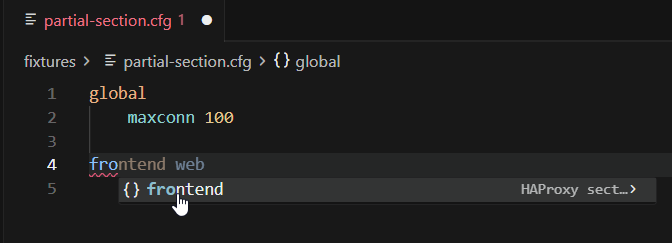
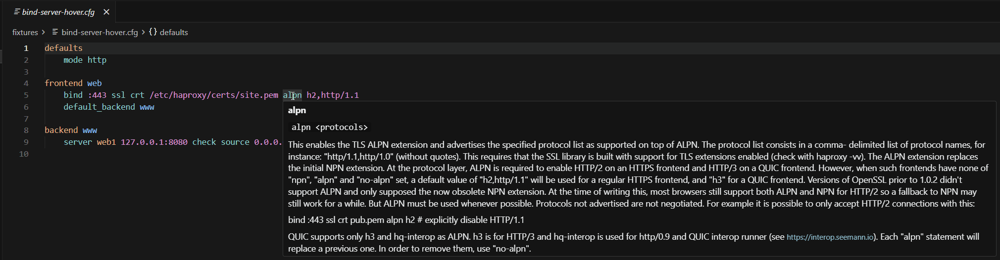
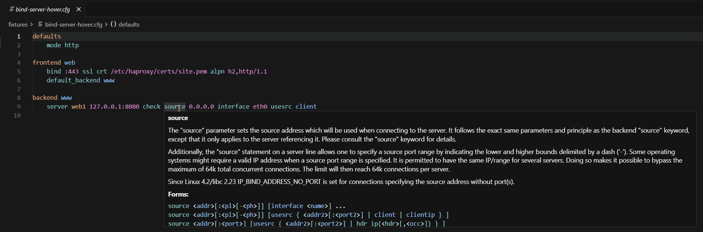
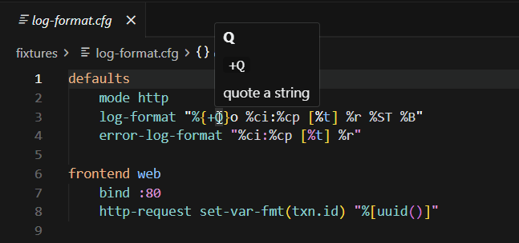
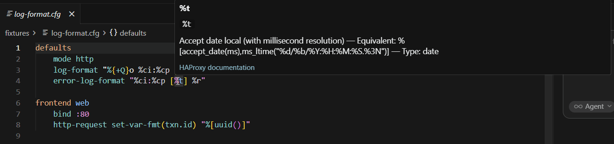
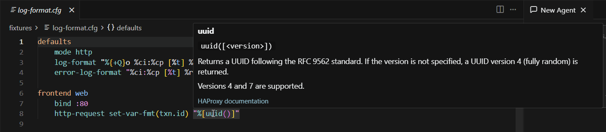
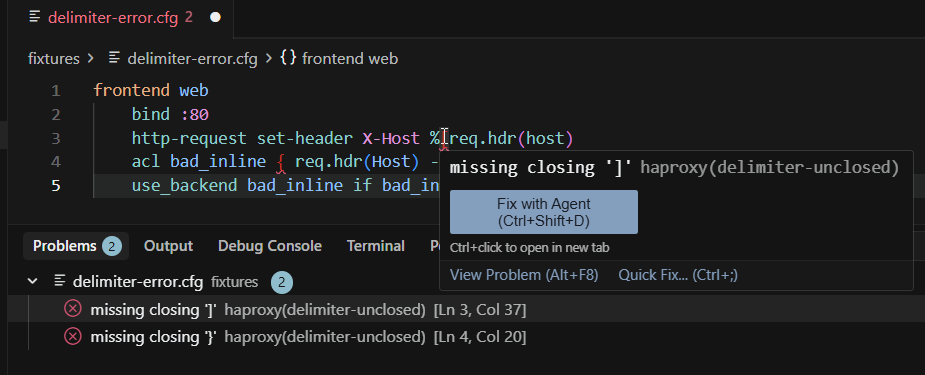
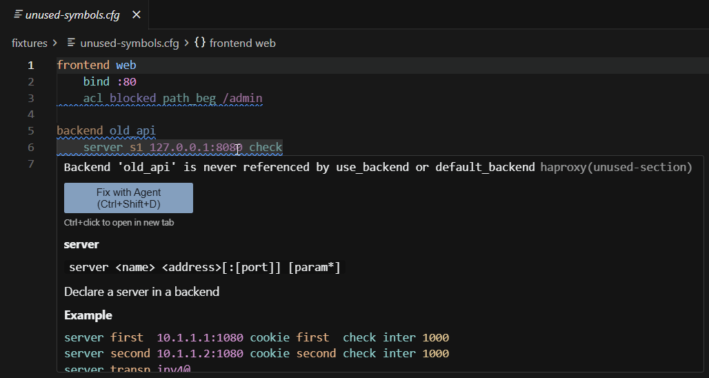
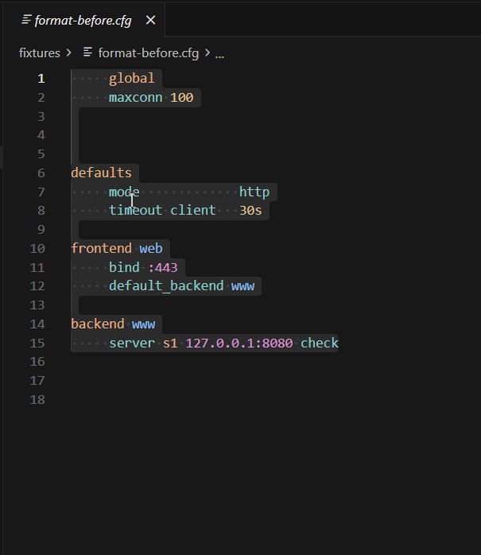
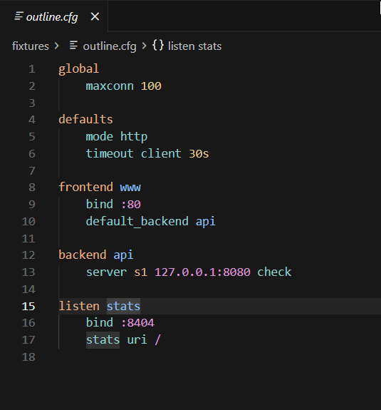

# HAProxy Language Support

[](https://github.com/Exymat/haproxy-vscode/actions/workflows/test.yml)
[](https://codecov.io/gh/Exymat/haproxy-vscode)
[](LICENSE)
[](https://github.com/Exymat/haproxy-vscode/issues)
[](https://nodejs.org/)

**Schema-driven language support for HAProxy configuration files** in Visual Studio Code and compatible editors.

Open any `.cfg` file and get syntax highlighting, context-aware completion, inline documentation, log-format intelligence, schema-based diagnostics, **rename symbol**, **symbol hover on references**, **go to definition** and **find all references** (including cross-file navigation and rename when the workspace graph is active), document formatting, and section outline — all tuned to the HAProxy release you run in production (**2.6**, **2.8**, **3.0**, **3.2**, or **3.4**).

---

## Features

### Syntax highlighting

Colorization is generated from HAProxy's own keyword inventory (`haproxy -dKall`), not hand-maintained lists. Sections, directives, ACLs, sample expressions, and related constructs are scoped consistently across large configs.


### Intelligent completion

Suggestions follow where you are in the file:

- **Global and section headers** (`global`, `defaults`, `frontend`, `backend`, `listen`, …), including partial matches on new top-level lines (`fron` → `frontend`)
- **Directives and keywords** valid for the current section
- **`option` / `default-server` values**, HTTP/TCP rule actions, ACL criteria
- **`bind` and `server` parameters**, stick-table keys, filter/trace arguments
- **Sample fetches and converters** inside expressions
- **Log-format aliases and flags** inside format strings (see **Log-format support** below)
- **Enum argument values** where the schema defines allowed choices (e.g. `mode tcp|http`)

Completion reloads immediately when you change the configured HAProxy version.




### Inline documentation

Hover any supported keyword to read summaries sourced from HAProxy's official `configuration.txt`. Many entries include a **link to the upstream HAProxy documentation** for the full reference. Conditional block directives (`.if`, `.elif`, `.else`, `.endif`) and status directives (`.diag`, `.notice`, `.warning`, `.alert`) are documented as well, and hovers distinguish section scope such as **Valid in sections: defaults, frontend, listen, backend** from mode scope such as **Valid in modes: tcp, http, log** when available.

- **`bind` / `server` line options** — nested sub-options (e.g. `source … interface`), manual ASCII tables rendered as markdown
- **Rule actions** — parenthesized actions (`set-var(...)`) and sample fetches (`req.hdr(...)`) show distinct documentation
- **Examples** from the manual where available
- **Symbol references** — hover a backend name, ACL, server, defaults profile, or other indexed reference to preview the defining line or full section body in a code block, with a **Peek Definition** link






### Log-format support

Format strings in directives such as `log-format`, `error-log-format`, `unique-id-format`, `set-var-fmt`, and `log-format-sd` get dedicated language support:

- **Completion** of log-format aliases and `{+flag}` modifiers inside format strings
- **Hover** on aliases and flags (including combined modifiers like `{+Q+E}`)
- **Diagnostics** for unknown aliases or flags







### Real-time diagnostics

Catch common mistakes while you type:

| Category     | Examples                                                                                                                                                                 |
| ------------ | ------------------------------------------------------------------------------------------------------------------------------------------------------------------------ |
| Keywords     | Unknown directive, keyword used in the wrong section, **deprecated** keyword                                                                                             |
| Structure    | Nested `option` / parameter misuse; keywords marked `(!)` in anonymous `defaults`; modifier-prefixed directives/actions                                                  |
| Arguments    | Missing or extra arguments for known statement shapes                                                                                                                    |
| Expressions  | Invalid sample fetch / converter references, ACL-only criteria misuse                                                                                                    |
| Delimiters   | Unclosed or mismatched `()`, `[]`, `{}`, quotes on a line (e.g. `%[req.hdr(host)`)                                                                                       |
| Addresses    | Invalid bind/server/source/usesrc forms, MPTCP and address-prefix rules                                                                                                  |
| Log format   | Unknown alias or flag inside format strings                                                                                                                              |
| Context      | Mode-aware `wrong-context` checks for directives/options that only apply to specific modes                                                                               |
| Rules        | Unknown or **deprecated** `http-request` / `tcp-request` action, unknown `use-service` target                                                                            |
| Symbols      | Missing ACL, backend, cache, userlist, resolvers, peers, or defaults profile (`missing-reference`); duplicate named section across workspace files (`duplicate-section`) |
| Entry points | Frontend or listen without `bind` / `bind-process` and no inherited bind in the same file (`no-bind-entry-point`)                                                        |

Diagnostics are **schema-based** — they help you write valid-looking config faster, but they do **not** replace `haproxy -c` for a full syntax check. Context checks use the effective runtime mode inferred from your section/config flow, but you should still validate with your real binary before deploying.

Suppress a specific same-line diagnostic with `# haproxy: ignore=<code>`, for example `# haproxy: ignore=unknown-action` or `# haproxy: ignore=unknown-action,unknown-keyword`. This is useful for runtime-provided module keywords that the bundled schema cannot know about, and diagnostics offer a Quick Fix to add or extend the ignore comment automatically.

**Missing-reference warnings** (on by default via `haproxy.diagnostics.missingReferences`) flag named references with no matching definition — ACLs, backends, cache, userlist, resolvers, peers, and named defaults profiles. When the workspace symbol graph is active, definitions in other indexed `.cfg` files satisfy the reference; environment variables are never flagged (external `$VAR` names without a local `setenv` simply have no jump target).

**Unused symbol hints** (on by default via `haproxy.diagnostics.unusedSymbols`) fade unused ACL lines (full-line) and unreferenced section blocks (backends, named defaults, cache, userlist, resolvers, peers) — similar to unused-code hints in Ty or Pylance. Server lines are not flagged; `use-server` is optional and pool members are valid without it. Frontends and listens without a `bind` or `bind-process` directive (including inherited defaults in the same file) are reported as **warnings** because they cannot accept connections. When the workspace symbol graph is active, a backend referenced from another file is not reported as unused. With the graph disabled or over configured limits, analysis falls back to the current file only. The graph indexes workspace files by glob — it does **not** follow HAProxy `include` directives or detect runtime-only references.






### Document formatting

Run **Format Document** (or enable format-on-save) to normalize layout according to HAProxy's configuration file rules:

- Section headers (`global`, `frontend`, …) stay left-aligned; directives inside a section are indented consistently.
- Comments and quoted strings are preserved; inline `#` comments stay on the same line.
- Optional blank lines are inserted before each new section header.
- Multiple blank lines between sections collapse to one; trailing blank lines at end of file are removed.

Indent style (4 spaces, 2 spaces, or tab) and blank-line behavior are configurable — see **Settings** below.



### Outline and folding

Navigate large configs with built-in structure support:

- **Outline** — lists every top-level section (`frontend www`, `backend api`, …) so you can jump quickly.
- **Folding** — collapse a section's body while keeping its header visible.



### Workspace symbol graph

Split HAProxy layouts — separate files for frontends, backends, ACLs, or shared defaults — are indexed into a **workspace symbol graph** (on by default via `haproxy.workspaceSymbols.enabled`):

- **Discovery** — matches workspace `.cfg` files using `haproxy.workspaceSymbols.include` (default `**/*.cfg`), excluding common build/vendor paths
- **Cross-file Go to Definition and Find References** — jump from `use_backend api` in one file to `backend api` in another; reference lists include usages across indexed files
- **Cross-file symbol diagnostics** — missing-reference and unused-section checks consult workspace definitions, so a backend used only from another file is not flagged
- **Duplicate section warnings** — warns when the same named frontend, backend, listen, defaults profile, cache, userlist, resolvers, or peers block is defined in more than one indexed file
- **Limits and fallback** — when disabled or when configured opt-in file, line, or byte limits are exceeded for a VS Code workspace folder, navigation, rename, and symbol diagnostics in that folder fall back to single-file behavior

The graph rebuilds after workspace file changes (debounced via `haproxy.workspaceSymbols.debounceMs`). It indexes files on disk in the workspace — not HAProxy `include` paths.

### Go to definition, find references, and rename

Jump across related config with standard editor navigation (**Go to Definition**, **Go to References**, **Rename Symbol**, peek view):

- **Frontends / backends / listen** — `use_backend`, `default_backend`, and section headers link to the matching proxy section; **Go to Definition** on a section highlights the full section body, not just the header line
- **ACLs** — definitions and uses in `if` / `unless` conditions within the same section (including negated forms like `!is_api`), chained implicit-AND references (`if is_static !is_image`), inline `{ … }` conditions, and compound `&&` / `||` expressions
- **Servers** — `server` lines and `use-server` references inside a backend or listen
- **Defaults profiles** — `defaults … from <profile>` links to the named profile
- **Filters, cache, userlist, resolvers, peers** — section and statement definitions indexed from the schema
- **Environment variables** — `setenv` / `presetenv` definitions and references from `unsetenv` / `resetenv`, double-quoted `$VAR` / `${VAR}` / `${VAR-default}` / `${VAR-sub}`, and `env(VAR)` sample fetches (single-file navigation and rename; not part of the workspace graph)
- **Rename Symbol** (F2) — with the workspace graph active, rename updates matching definitions and references across indexed `.cfg` files for backends, ACLs, defaults profiles, servers, filters, and related named sections. Environment variable rename remains single-file. Invalid names and same-scope collisions (including an existing name in another indexed file) are rejected

Reference resolution is **schema-driven** via reference patterns in the bundled language data, not hardcoded heuristics. With the workspace graph active, definitions, references, and rename for non-environment symbols can span multiple `.cfg` files. Narrow scope with `haproxy.workspaceSymbols.include` or disable workspace symbols when independent configs share names — duplicate section names across unrelated files can make cross-file rename affect more than you intend. When the graph is disabled or over configured limits, rename falls back to the current file


---

## Getting started

1. **Install** the extension from the Marketplace (or load a `.vsix` locally).
2. **Open** a HAProxy config (`.cfg` extension is recognized automatically; `#` line comments, bracket matching, and auto-closing pairs are enabled). For cross-file navigation and workspace symbol diagnostics, open a **workspace folder** containing your `.cfg` files.
3. **Choose your HAProxy version** so completion, hover, diagnostics, formatting, and highlighting match your deployment (see below).

No extra runtime is required for day-to-day editing — schemas and grammars ship with the extension. If bundled schema or language data fails to load, the extension shows a one-time error notification.

---

## HAProxy version

Pick the release that matches the binaries you operate:

| Version | Default? | Notes                                      |
| ------- | -------- | ------------------------------------------ |
| **3.2** | Yes      | Recommended for most users on the 3.x line |
| **3.4** |          | Latest supported 3.x line                  |
| **3.0** |          | 3.x LTS                                    |
| **2.8** |          | Latest supported 2.x line                  |
| **2.6** |          | 2.x LTS                                    |

Schemas for **2.6** and **2.8** are generated from the legacy `configuration.txt` layout (actions listed under each ruleset in §4.2 rather than §4.3/§4.4). Completion, diagnostics, and hover reflect keywords available in that release.

**Ways to change version:**

- **Status bar** — click **HAProxy** while a `.cfg` file is active.
- **Command Palette** — run **HAProxy: Select HAProxy Version**.
- **Settings** — set **HAProxy: Version** (`haproxy.version`).

Completion, diagnostics, and hover update as soon as the setting changes. Syntax highlighting switches the active TextMate grammar; if colors do not refresh, use **Developer: Reload Window** when prompted.


---

## Settings

| Setting                                         | Default         | Description                                                                                                                                                              |
| ----------------------------------------------- | --------------- | ------------------------------------------------------------------------------------------------------------------------------------------------------------------------ |
| `haproxy.version`                               | `3.2`           | HAProxy release used for completion, diagnostics, hover, and syntax highlighting                                                                                         |
| `haproxy.diagnostics.enabled`                   | `true`          | Turn off if opening very large `.cfg` files feels slow                                                                                                                   |
| `haproxy.diagnostics.debounceMs`                | `500`           | Delay after edits before recomputing diagnostics (100-5000 ms)                                                                                                           |
| `haproxy.diagnostics.maxLines`                  | `4000`          | Skip diagnostics above this line count to limit memory use                                                                                                               |
| `haproxy.diagnostics.deprecatedWarnings`        | `true`          | Warn on directives and rule actions marked `(deprecated)` in the official docs. Warnings are suppressed when `global` contains `expose-deprecated-directives`.           |
| `haproxy.diagnostics.unusedSymbols`             | `true`          | Hint and fade unused ACL lines and unreferenced section blocks in the current file (Ty-style unnecessary-code styling). Turn off if you prefer a cleaner Problems panel. |
| `haproxy.diagnostics.missingReferences`         | `true`          | Warn when a named reference (ACL, backend, cache, userlist, resolvers, peers, defaults profile) has no definition in the current file or workspace graph.                |
| `haproxy.workspaceSymbols.enabled`              | `true`          | Build a workspace-level symbol graph for cross-file navigation and symbol diagnostics across split `.cfg` layouts.                                                       |
| `haproxy.workspaceSymbols.include`              | `["**/*.cfg"]`  | Glob patterns for HAProxy files included in the workspace symbol graph.                                                                                                  |
| `haproxy.workspaceSymbols.exclude`              | see description | Glob patterns excluded from workspace indexing (default: `.git`, `node_modules`, `dist`, `out`, `vendor`).                                                               |
| `haproxy.workspaceSymbols.maxFiles`             | `0`             | Optional maximum indexed files per VS Code workspace folder; `0` means unlimited.                                                                                        |
| `haproxy.workspaceSymbols.maxTotalLines`        | `0`             | Optional maximum total indexed lines per VS Code workspace folder; `0` means unlimited.                                                                                  |
| `haproxy.workspaceSymbols.maxFileBytes`         | `0`             | Optional maximum bytes per indexed HAProxy file; `0` means unlimited.                                                                                                    |
| `haproxy.workspaceSymbols.maxTotalBytes`        | `0`             | Optional maximum total indexed bytes per VS Code workspace folder; `0` means unlimited.                                                                                  |
| `haproxy.workspaceSymbols.maxLineBytes`         | `0`             | Optional maximum encoded bytes per line in an indexed HAProxy file; `0` means unlimited.                                                                                 |
| `haproxy.workspaceSymbols.debounceMs`           | `750`           | Delay after workspace file changes before rebuilding the symbol graph (100-10000 ms).                                                                                    |
| `haproxy.format.enabled`                        | `true`          | Enable **Format Document** for HAProxy configs                                                                                                                           |
| `haproxy.format.indent`                         | `spaces-4`      | Indentation inside sections: `spaces-4`, `spaces-2`, or `tab`                                                                                                            |
| `haproxy.format.insertBlankLineBetweenSections` | `true`          | Insert a blank line before each new section header when formatting                                                                                                       |

The extension also raises `editor.maxTokenizationLineLength` for HAProxy files so long `server` / `bind` lines tokenize correctly.

Pre-0.12 settings `haproxy.format.indentStyle` and `haproxy.format.indentSize` are still honored as a fallback when `haproxy.format.indent` is unset.


---

## Commands

| Command                             | Description                                    |
| ----------------------------------- | ---------------------------------------------- |
| **HAProxy: Select HAProxy Version** | Quick-pick between 2.6, 2.8, 3.0, 3.2, and 3.4 |

---

## How it works

Language data is built offline from two upstream sources:

1. **`configuration.txt`** — descriptions and documentation structure per HAProxy release.
2. **`haproxy -dKall`** — the complete keyword list emitted by the binary.

Those inputs are merged into JSON schemas, completion/hover payloads, and TextMate grammars (see the companion [**haproxy-schema**](https://github.com/Exymat/haproxy-schema) repository). The VS Code extension loads the bundled artifacts for the version you select — no Python or local HAProxy install needed to **use** the extension.

---

## Performance

The extension is built for interactive editing. The table below shows **median** timings from our automated micro-benchmarks (`npm run bench`) on Node.js 24 - they exercise the same TypeScript code paths as the extension host, using bundled schemas and synthetic `.cfg` fixtures.

| Operation                                                     | Small config (~18 lines) | Medium config (~100 lines) | Stress config (24,000 lines) |
| ------------------------------------------------------------- | ------------------------ | -------------------------- | ---------------------------- |
| **Startup** - load schema + language data (first `.cfg` open) | -                        | -                          | ~19 ms                       |
| **Syntax highlighting** - full grammar tokenize[^1]           | ~7 ms                    | ~11 ms                     | ~1.8-2.2 s                   |
| **Diagnostics** - one full pass[^2]                           | ~0.1 ms                  | ~0.8 ms                    | ~210-360 ms                  |
| **Diagnostics** - incremental edit revalidation[^2]           | ~0.02 ms                 | ~0.08 ms                   | ~20 ms                       |
| **Diagnostics + unused-symbol hints**                         | -                        | -                          | ~210-360 ms                  |
| **Diagnostics + unused-symbol hints** - incremental edit[^2]  | -                        | -                          | ~25 ms                       |
| **Format document**                                           | <0.01 ms                 | ~0.08 ms                   | ~30 ms                       |
| **Completion** at cursor                                      | <0.01 ms                 | -                          | ~19 ms                       |
| **Hover**                                                     | <0.1 ms                  | -                          | <0.1 ms                      |
| **Go to definition / references**                             | <0.01 ms                 | -                          | ~1 ms                        |

**What this means in practice**

- **Everyday configs** (hundreds to a few thousand lines) stay responsive: diagnostics, completion, and hover are sub-millisecond to low tens of milliseconds per operation.
- **Incremental diagnostics are now the fast path during editing.** On the 24k-line stress fixtures, a single-line edit revalidates in about **20 ms** without unused-symbol hints and **25 ms** with them enabled. The same edits take about **236 ms** and **361 ms** respectively when forced through a full recompute baseline.
- **Diagnostics still dominate** full-pass cost on very large files - the main reason `haproxy.diagnostics.maxLines` defaults to **4000** and very large files skip validation unless you raise that limit. CI guards the incremental stress-edit path at p99.5 under **45 ms** without unused-symbol hints and **40 ms** with them (robust thresholds from 21 CI runs), while full-pass stress benchmarks remain guarded separately.
- **Highlighting** scales with file size; the editor tokenizes incrementally, so the stress numbers above are a full-file worst case, not what you pay on every keystroke. Grammars are **line-isolated** (no `begin`/`end` region may carry state past end-of-line), so tokenization cost reflects correct per-line highlighting even when earlier lines contain deliberate syntax errors.
- **Stress fixtures:** `large-valid.cfg` (mostly valid) tokenizes at ~**2.2 s** median; `large-mixed.cfg` (valid baseline plus injected invalid lines every ~5 blocks) at ~**1.8 s** median. The p99.5 tokenization thresholds are **2.7 s** and **2.2 s** respectively.
- **Startup** pays a one-time ~19 ms JSON parse when the extension first loads language data for your selected HAProxy version; the p99.5 threshold is **30 ms**.

CI runs these benchmarks on every push (`npm run bench:ci`) and tracks regressions against [`test/bench/thresholds.json`](test/bench/thresholds.json). To reproduce locally:

```powershell
npm run bench
```

[^1]: Measured with `vscode-textmate` against the shipped grammar - a proxy for editor highlighting cost.

[^2]: After `haproxy.diagnostics.debounceMs` (default 500 ms) following each edit in the real editor.

---

## Report issues

Found a false positive, missing completion, or wrong hover text? Open an issue on [GitHub](https://github.com/Exymat/haproxy-vscode/issues).

**Required information** — issues without these details are hard to reproduce and may be closed:

1. **Offending config** — paste the exact line(s) or a minimal snippet that triggers the problem (redact secrets; keep structure intact).
2. **Error or unexpected behavior** — copy the full diagnostic message from the Problems panel, or describe what you expected vs. what happened (e.g. no squiggle, wrong completion list).

**Helpful context** (include when relevant):

- **HAProxy: Version** (`haproxy.version`) — e.g. `3.2`
- Extension version and editor (VS Code version)
- Whether `haproxy -c` accepts or rejects the same config on your binary

---

## Contributing

The extension repo is **self-contained for CI**: unit and integration tests use bundled schemas under `schemas/` and config snippets under `test/fixtures/`. No sibling checkout is required to run `npm test` or `npm run test:coverage`.

Schema generation and upstream config corpus validation live in the companion [**haproxy-schema**](https://github.com/Exymat/haproxy-schema) repository. Optional monorepo checkouts are only for regeneration and extended local validation:

```
parent/
  haproxy-vscode/     # this extension (CI runs here)
  haproxy-schema/     # schema & grammar generator (python -m haproxy_schema)
  haproxy_git/        # optional: upstream HAProxy trees for regeneration & test:upstream
    haproxy-2.6/
    haproxy-2.8/
    haproxy-3.0/
    haproxy-3.2/
    haproxy-3.4/
```

### Extension

From `haproxy-vscode/`:

```powershell
npm install
npm run compile
```

`compile` only builds TypeScript. HAProxy version-specific schema/language data is loaded at extension startup from `haproxy.version` (default `3.2`), and grammar switching is handled by the extension when the version changes.

Use **Run HAProxy Extension** in the Run and Debug view after compiling.

Lint and format (enforced in CI):

```powershell
npm run lint
npm run format:check
npm run format    # auto-fix formatting
```

```powershell
npm test
```

Runs Vitest unit tests and VS Code Extension Development Host integration tests. Tests load bundled schemas and fixtures from `test/fixtures/` (including curated upstream snippets in `test/fixtures/golden/`). For coverage only:

```powershell
npm run test:coverage
```

For extended local validation (grammar check, full upstream scans, `haproxy -c` comparison) when sibling repos are present:

```powershell
npm run test:all
```

Optional upstream-only scripts (require sibling `haproxy_git/`):

```powershell
npm run test:upstream
npm run compare:haproxy
npm run compare:haproxy:matrix
npm run compare:haproxy:docker:matrix
```

`compare:haproxy:matrix` runs `haproxy -c` parity checks for all supported versions (`2.6`, `2.8`, `3.0`, `3.2`, `3.4`) against matching upstream `tests/conf` directories.
`compare:haproxy:docker:matrix` uses Docker images `haproxy:<version>-trixie` as ground truth and checks both `tests/conf/*.cfg` and `examples/*.cfg` for each version.

To run schema pytest plus extension tests from a monorepo layout:

```powershell
.\haproxy-schema\scripts\test-all.ps1
```

### Regenerating schemas

Set `PYTHONPATH` to the **haproxy-schema** repo root, then from `haproxy-vscode/`:

```powershell
$env:PYTHONPATH = (Resolve-Path "..\haproxy-schema").Path
npm run generate:schema
npm run compile
```

`generate:schema` regenerates every supported version (`2.6`, `2.8`, `3.0`, `3.2`, `3.4`). You can still regenerate one specific version with `npm run generate:schema:<version>`. To refresh keyword dumps (requires a DEBUG build of the matching HAProxy binary in `haproxy_git/`):

```powershell
npm run generate:dkall:2.6
npm run generate:dkall:2.8
npm run generate:dkall:3.2
```

See [**haproxy-schema** README](https://github.com/Exymat/haproxy-schema) for `dkall` generation, binary installation, pytest, and upstream golden-config validation.

### Packaging

```powershell
npm run package
```

Produces a `.vsix` via `@vscode/vsce` (`vscode:prepublish` compiles TypeScript automatically).

---

## License

[MIT](LICENSE). See [NOTICE](NOTICE) for third-party and data-source attributions.

Bundled files under `schemas/` and `syntaxes/` are generated from HAProxy `configuration.txt` and `haproxy -dKall` output via the companion [**haproxy-schema**](https://github.com/Exymat/haproxy-schema) project (Apache-2.0). Documentation excerpts in hover and completion payloads are derived from HAProxy's official configuration reference (GPL-2.0-or-later). Keyword-line parsing in haproxy-schema is aligned with [haproxy-dconv](https://github.com/cbonte/haproxy-dconv) (Apache-2.0).
